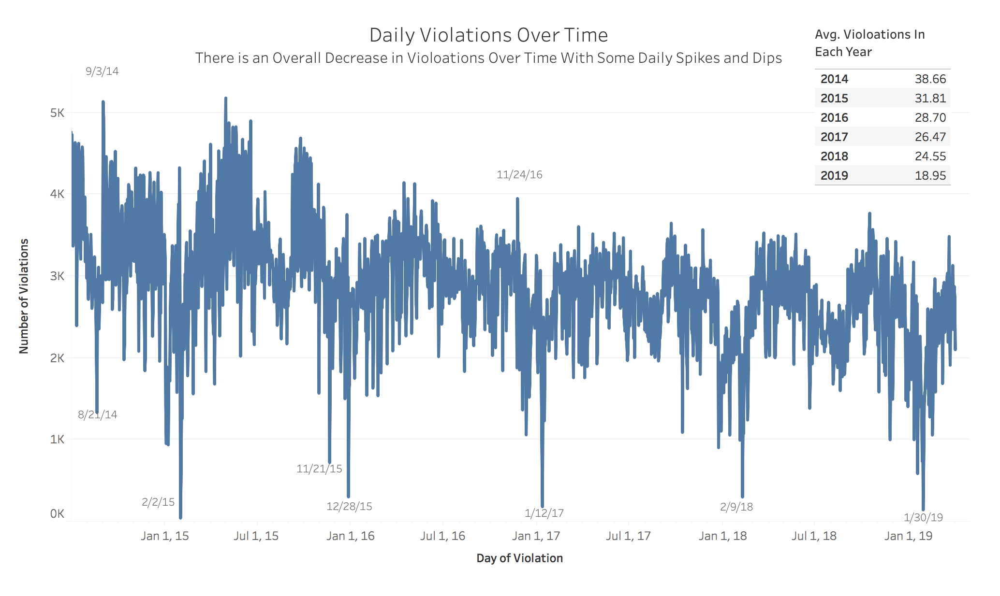
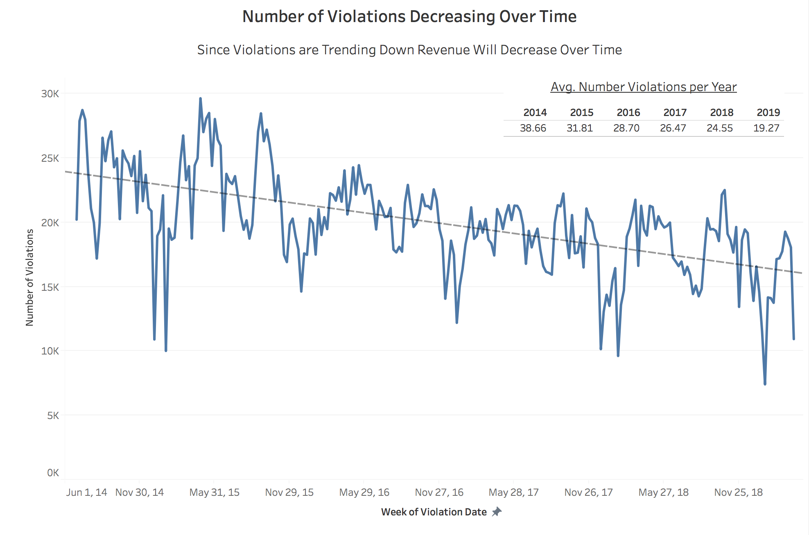
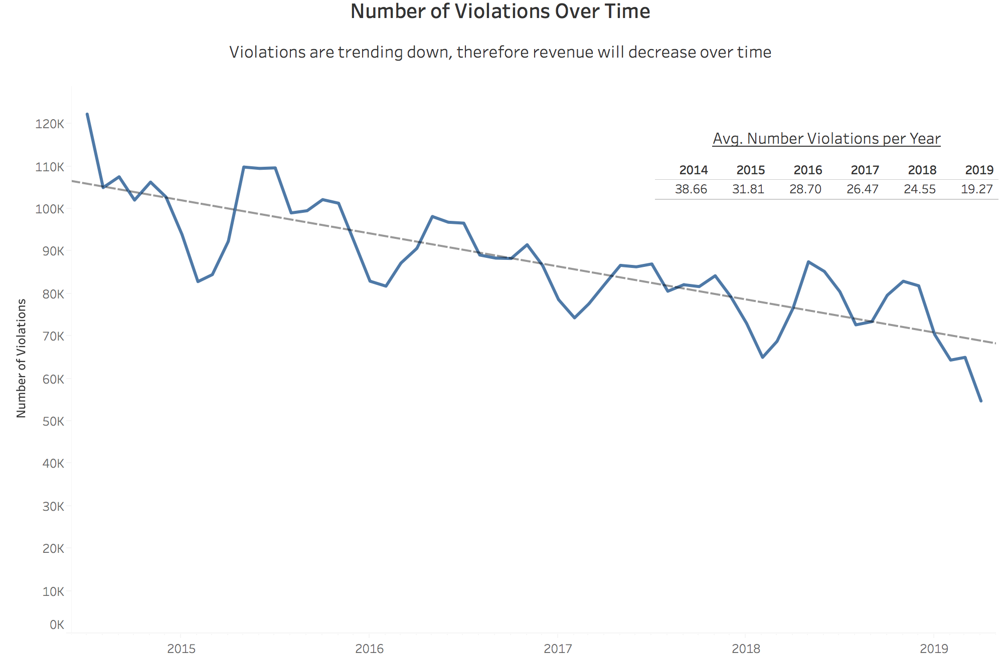
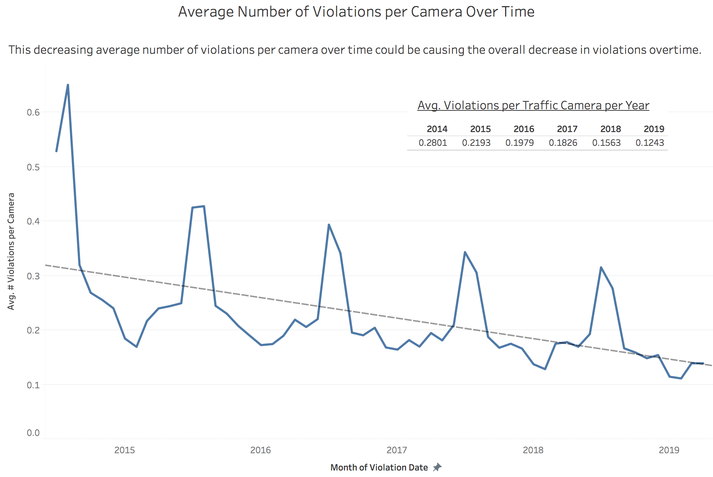
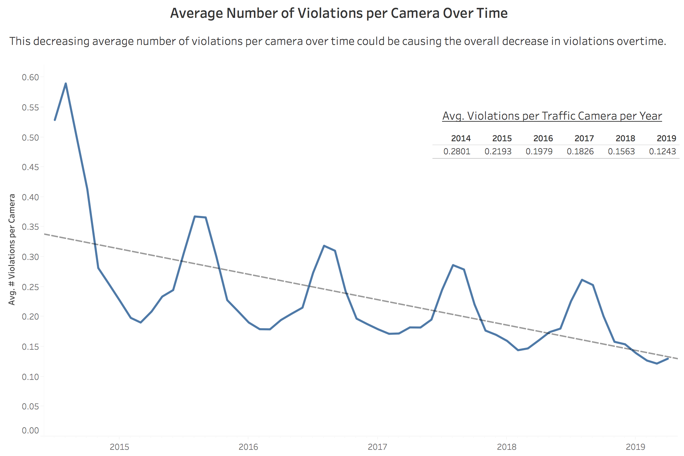
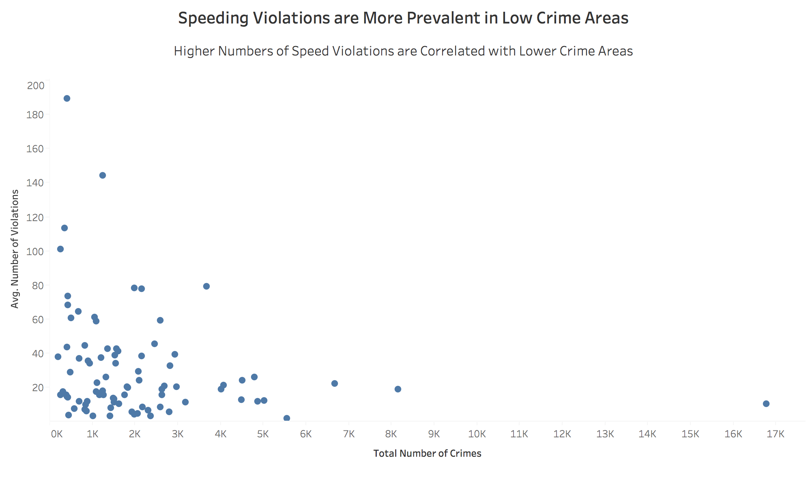
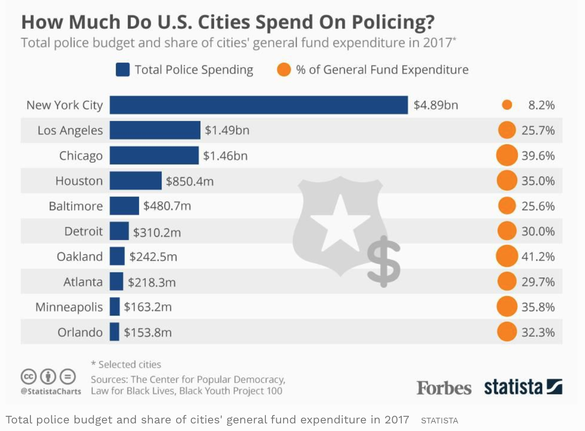

# Chicago-Traffic-Violations

### Project Overview
The goal was to create a set of visualizations about the traffic cameras in Chicago intended for the Mayor of Chicago. The project included downloading the data from the City of Chicago's Website and understanding the information from the data: https://data.cityofchicago.org/Transportation/Speed-Camera-Violations/hhkd-xvj4/data. 

Then the first round of data visualizations was intended to explore the data set using Tableau and then to further develop a deeper analysis based on that exploration. 

Data Exploration: https://public.tableau.com/profile/laura.klipp#!/vizhome/Speed_Violations/TrafficCameraDataExploration

First Round Analysis: https://public.tableau.com/profile/laura.klipp#!/vizhome/Data_for_Mayor/DB-ViolationsCam

### Data Set Information

The Chicago Speed Camera Violations dataset contains the number of traffic violations that occurred over time from July 1, 2014, through April 10, 2019. The violations in the dataset reflect all instances collected by the camera's radar system that have been viewed by two individual city contractors, including instances not resulting in a citation.

In an effort to increase the safety for children in the City of Chicago, speed cameras were installed in key children’s safety zones around schools and parks. School zones have active cameras Monday through Friday from  7 am to 4 pm when children are present, whereas cameras near parks are active 365 days per year, generally from 6 am until 11 pm. Fines for violations 10 miles per hour (MPH) or less is $35.00, and violations 11 MPH and over is $100.
https://www.chicago.gov/city/en/depts/cdot/supp_info/children_s_safetyzoneporgramautomaticspeedenforcement.html

The second dataset about alleged crimes in Chicago was also examined to look at the relationship between the number of speeding violations and the amount of criminal activity in Chicago. The data was extracted from the Police Department's Citizen Law Enforcement Analysis and Reporting (CLEAR) system and spanned from May 7, 2015 through April 14, 2019. In order to protect the privacy of the victims, locations are only given at the block level. 
https://data.cityofchicago.org/Public-Safety/Crimes-2001-to-present/ijzp-q8t2

In order to examine the relationship between crimes and speed violations, the data sets were cleaned and merged on a truncated longitude and latitude. In the exported csv files, the null values were discarded, then longitudes and latitudes were decreased to show only until the 100's place after the decimal for less precision. In the python notebook attached, the average number of violations were grouped by the unique set of truncated coordinates and the number of crimes were summed at an aggregated level for each unique truncated coordinates. The data was merged to show overlapping coordinate pairs between the two data sets.   

### Data Exploration and Final Analysis
The first stage of data exploration lead to the discovery that the number of violations were decreasing overtime. 

https://public.tableau.com/profile/laura.klipp#!/vizhome/Speed_Violations/TrafficCameraDataExploration

Since the daily violations over time show a lot of noise. My next visualization shows the same number of violations, but at a weekly level for a smoother graph. While it is clear to see the downward trend over time, there is still a lot of  seasonality to this data and therefore adding a trendline shows the decrease more clearly. The final visualization shows a 2 month moving average to further smooth out the declining trend in violations per month over time. 

https://public.tableau.com/profile/laura.klipp#!/vizhome/Data_for_Mayor/DecreasingViolations

https://public.tableau.com/profile/laura.klipp#!/vizhome/Data_for_Mayor_v2/DecreasingViolations

While many factors could affect the declining number of violations over time, the intended outcome was for people to stop speeding through children's safety zones. One way to see that is to see how the number of violations per camera changes over time, to ensure that it wasn't a decreased number of cameras causing a decrease in violations. Making a calculation of the average number of violations per unique camera ID helps us to see that there is also a decline in the average violations for each camera over time. The second version of this graph shows a smoothed 2 month moving average of the mean number of violations per month over time. 

https://public.tableau.com/profile/laura.klipp#!/vizhome/Data_for_Mayor/DecreasingViolations

https://public.tableau.com/profile/laura.klipp#!/vizhome/Data_for_Mayor_v2/DecreasingViolations

As mentioned above, the next goal was to look at the correlation between the total amount of crime and the average number of speeding violations there were in the same location. Based on this analysis, it seems that the higher average quantity of speeding violations in a given area is in lower crime areas and that higher crime areas have fewer violations on average. 

https://public.tableau.com/profile/laura.klipp#!/vizhome/Data_for_Mayor_v2/DecreasingViolations

This finding is interesting due to Chicago being a city with the some of the highest amount spent on their police department as well as a city with some of the highest proportion of their overall budget spent on their police department. 

https://www.forbes.com/sites/niallmccarthy/2017/08/07/how-much-do-u-s-cities-spend-every-year-on-policing-infographic/#17321124e7b7

Chicago is rated the 21st most dangerous city in America according to USA Today, which means that the police should generally be more concerned with instances involving more violent crime rather than spending time giving out traffic citations. All cities use driving violations to increase their revenue, and in higher crime areas, the choice would need to be made either to increase their police force to maintain the ability to handle both traffic violations and address criminal activity or lose the ability to do both effectively. The speeding cameras allow for Chicago to maintain revenue streams from traffic violations as well as decrease the number of citizens speeding in children's safety zones, as well as allowing cops to focus on higher crime areas. Due to the effectiveness of this program, the mayor should consider increasing the number of cameras in additional children's safety zones. 
https://www.usatoday.com/picture-gallery/travel/experience/america/2018/10/17/25-most-dangerous-cities-america/1669467002/
